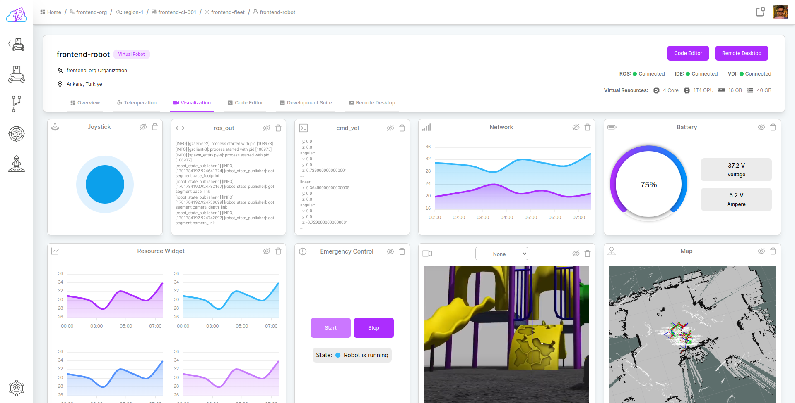
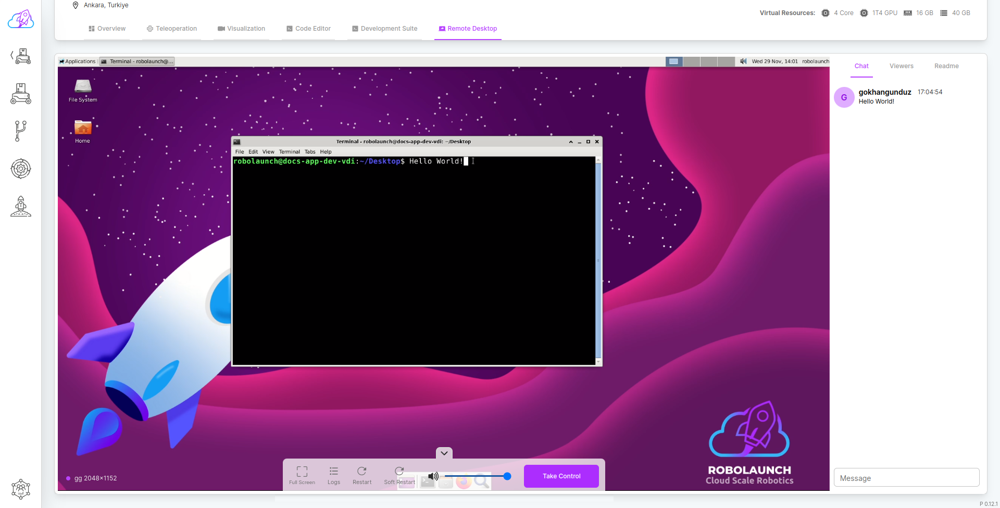

#  robolaunch UI

<div align="center">
  <p align="center">
    <a href="https://github.com/nodejs">
      
    </a>
    <a href="https://github.com/robolaunch/ui/releases">
      
    </a>
        <a href="#">
      
    </a>
    <a href="https://github.com/robolaunch/ui/actions">
      
    </a>
  </p>
</div>

## Table of Contents

- [Overview](#overview)
- [Quick Start](#quick-start)
- [Aims & Roadmap](#aims--roadmap)
- [Contributing](#contributing)

## Overview

robolaunch is a Cloud-Native Robotics Platform that provides the end-to-end infrastructure, software stack and tools for developing, simulating, deploying and operating ROS/ROS2 robots at scale.

## Screenshots


_Visualization_


_Development-Suite_


_Regions-Dashboard_


_Remote-Desktop_


_Instance-Dashboard_

## Quick Start

To use robolaunch-ui, you must first have Node.js installed on your computer. You can then follow the steps below:

### Step 1

Clone or download robolaunch-ui repository. You can start here;

```bash
git clone https://github.com/robolaunch/ui
```

### Step 2

Run this command to download the packages the project depends on.

```bash
npm install
```

### Step 3

Run the following command to start the project

```bash
npm start
```

## Contributing

Please see [this guide](./CONTRIBUTING.md) if you want to contribute.
